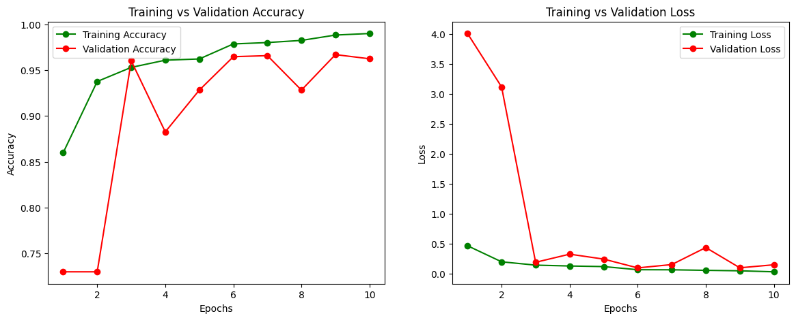
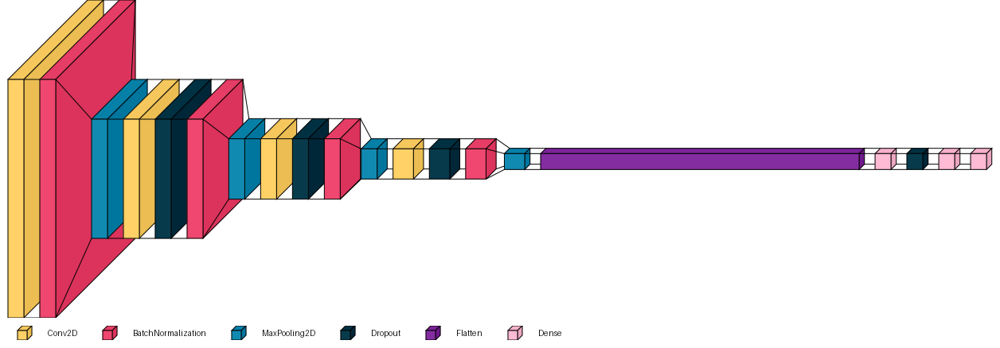
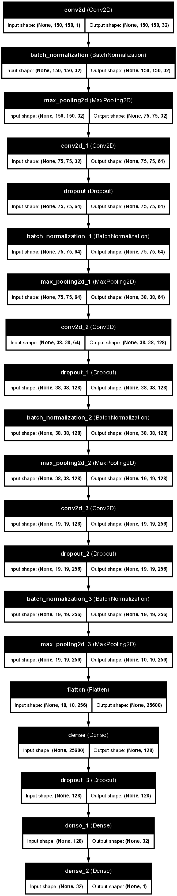
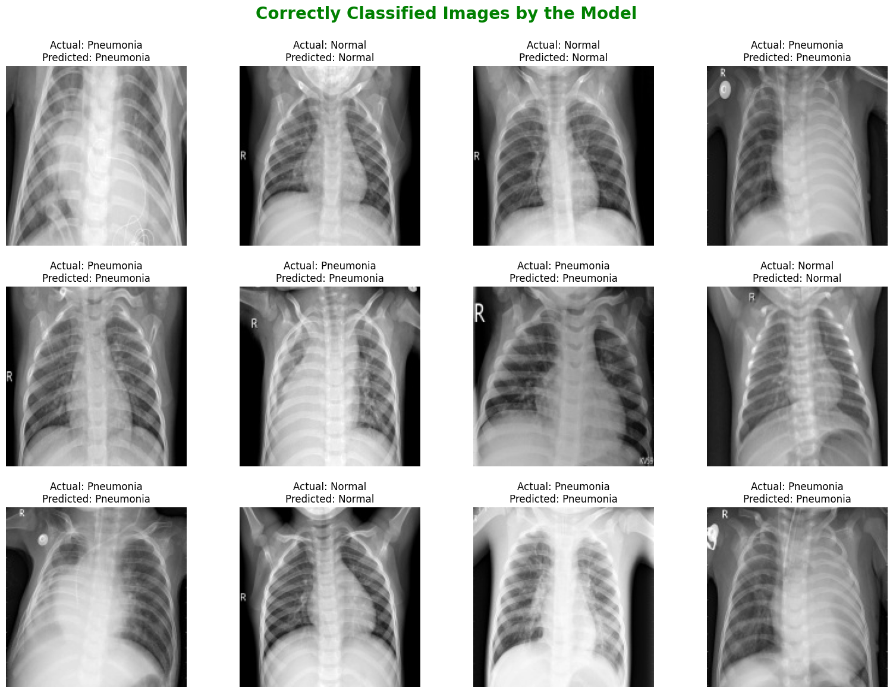
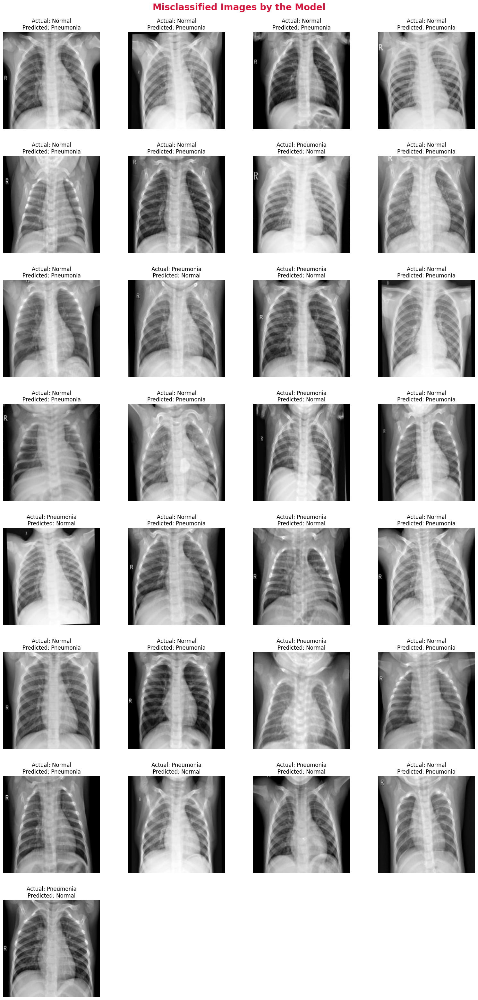

# PneumoNet: Pneumonia Detection from Chest X-rays

A deep learning project that classifies chest X-ray images as **NORMAL** or **PNEUMONIA** using a custom Convolutional Neural Network (CNN). The project is built with TensorFlow/Keras and features both a REST API deployed via FastAPI and an interactive web interface using Streamlit.

## Model Performance

| Metric | Train | Test |
|--------|-------|------|
| Accuracy | 98.29% | 95.90% |
| Loss | 0.0537 | 0.1025 |



## Project Structure

```text
PneumoNet/
├── assets/                       # Images and architecture diagrams
├── data/                         # Datasets (not tracked by Git)
│   ├── raw/                      # Raw Chest X-ray images
│   └── processed/                # Split, resized, and balanced data
├── models/                       # Pre-trained models (.keras, .h5)
├── notebooks/                    # Jupyter notebooks for experiments
├── src/                          # Source code package
│   ├── config.py                 # Centralized configuration
│   ├── data_loader.py            # Data pipeline (split, resize, load, balance)
│   ├── model.py                  # CNN architecture (PneumoNet)
│   ├── train.py                  # Training pipeline
│   ├── evaluate.py               # Evaluation & visualization
│   └── inference.py              # Single-image prediction
├── app.py                        # FastAPI web backend
├── streamlit_app.py              # Streamlit interactive web interface
├── requirements.txt              # Python dependencies
└── README.md                     # Project documentation
```

## Quick Start

### 1. Setup Environment

```bash
# Create virtual environment
python -m venv venv

# Activate it
# Windows:
venv\Scripts\activate
# Linux/Mac:
source venv/bin/activate

# Install dependencies
pip install -r requirements.txt
```

### 2. Run the Applications

**Run the FastAPI Backend:**
```bash
uvicorn app:app --reload --host 0.0.0.0 --port 8000
```
Then open **http://localhost:8000/docs** for the interactive Swagger UI.

**Run the Streamlit Interface:**
```bash
streamlit run streamlit_app.py
```
This will open a web browser where you can easily upload images and test the model interactively.

### 3. Make a Prediction (CLI)

```bash
python -m src.inference path/to/chest_xray.jpg
```

### 4. Train the Model (from scratch)

```bash
python -m src.train
```

## Architecture





The PneumoNet CNN follows this architecture:

```text
Input (150×150×1 Grayscale)
  → [Conv2D(32) → BatchNorm → Conv2D(32) → BatchNorm → MaxPool → Dropout(0.25)]
  → [Conv2D(64) → BatchNorm → Conv2D(64) → BatchNorm → MaxPool → Dropout(0.25)]
  → [Conv2D(128) → BatchNorm → Conv2D(128) → BatchNorm → MaxPool → Dropout(0.25)]
  → Flatten → Dense(256, ReLU) → BatchNorm → Dropout(0.5)
  → Dense(1, Sigmoid)
```

## Sample Predictions

### Correctly Classified


### Misclassified


## API Endpoints

| Method | Endpoint | Description |
|--------|----------|-------------|
| `GET` | `/` | API info |
| `GET` | `/health` | Health check |
| `POST` | `/predict` | Upload X-ray image for prediction |
| `GET` | `/docs` | Swagger UI documentation |

**Example Response (`/predict`):**

```json
{
  "filename": "chest_xray_001.jpg",
  "label": "PNEUMONIA",
  "confidence": 0.9712,
  "class_index": 1
}
```

## Module Overview

| Module | Description |
|--------|-------------|
| `config.py` | Centralized configurations for paths, images, and training |
| `data_loader.py` | Data splitting, resizing, loading, and balancing pipelines |
| `model.py` | CNN architecture definition |
| `train.py` | Model training and history logging |
| `evaluate.py` | Model evaluation and result visualization |
| `inference.py` | Prediction logic for new images |

## License

This project is for educational purposes.
